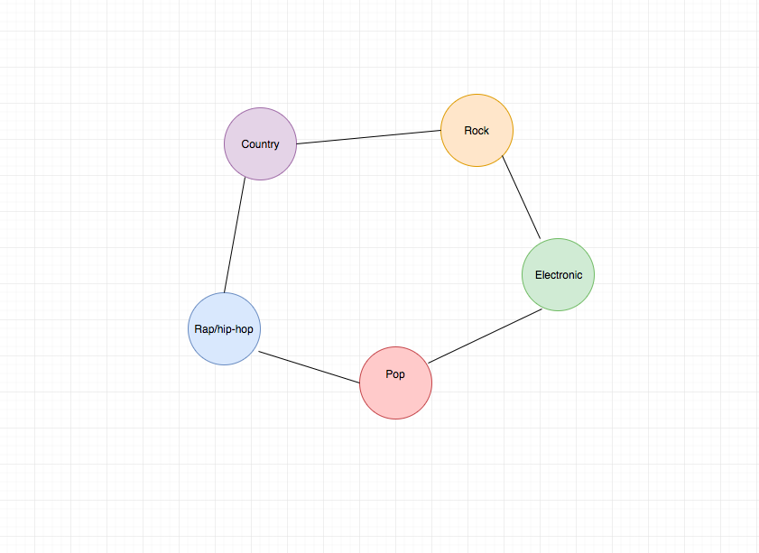

## GenreViz - Music genre data vizualization 

### LIVE LINK

https://kpchoy.github.io/genre-viz/

### Background and Overview

GenreViz is a music data visualization project that implements force with D3js. GenreViz implements lastfm's API to fetch data for current top tracks sorted by their respective genre.

Users can click and drag various different genres, and the songs belonging to that genre. 

The songs will be the current top 50 songs from lastfm's Top Tracks Chart. 

The goal is to make the different circles interactive, and also have a force component so that the nodes can be moved around on the DOM.

### Functionality & MVP  

In GenreViz a user will be able to:

- [ ] hover over their selected genres they wish to view
- [ ] have music titles linked to different genres
- [ ] use lastfm's API to fetch data for the current top tracks
- [ ] pull / drag a node and the node responds 

### Wireframes 

The header will contain the title of the app, link to my linkedin and github. 

The songs will be extremely small nodes around a parent circle. 

If a genre is clicked and dragged, its child elements (songs) follow their genre around the screen.  

### Architecture and Technologies

The project utilizes lastfm's API

JQuery is used to fetch data from lastfm's API

D3js v5 is used as the physics engine

CSS styling for a clean and seamless design 

### Implementation Timeline

Weekend 
- [ ] decide which project to select and do research on different libraries available 
- [ ] think about different ways to implement the initial idea

First Day 
- [ ] research more on the implementation of D3js and force properties
- [ ] create the initial html document with the corresponding javascript and css files 
- [ ] begin to determine how to properly use lastfm's API

Second Day 
- [ ] fetch the data from lastfm's API in JSON format
- [ ] determine how to convert the JSON information to the node format required by D3js

Third Day 
- [ ] create the nodes for D3js to render on the screen
- [ ] render the links to connect songs to genres
- [ ] add the force component for all the nodes and links

Fourth Day
- [ ] continue to make sure the force components work as desired
- [ ] style the page so that all the circles and nodes are asthetically pleasing 
- [ ] style the page for any information needed or desired background 

Bonus Features 

- [ ] make the visualization 3D 
- [ ] play the song if a user clicks on a song 
