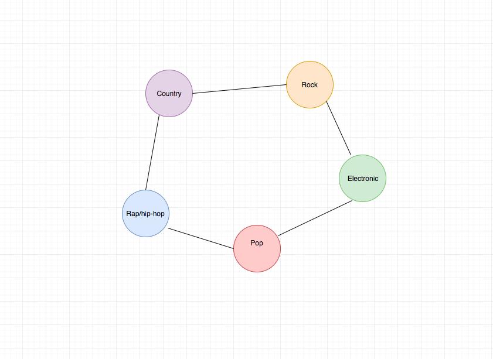

## GenreViz - Music genre data vizualization 

### Background and Overview

Users can click on various different genres. When they hover over a particular genre more nodes come out the node with links to songs. 

The songs will be the current top 100 songs from billboard top 100. 

The goal is to make the different circles interactive, and also have a force component so that the nodes can be moved around on the DOM.

### Functionality & MVP  

In GenreViz a user will be able to:

- [ ] hover over their selected genres they wish to view
- [ ] have music titles linked to different genres
- [ ] music titles will resize depending on whether or not a user has hovered over genre 
- [ ] pull / drag a node and the node responds 

### Wireframes 

The header will contain the title of the app, link to my linkedin and github. 

The songs will be extremely small nodes around a parent circle. 

Once a genre is hovered over, the child nodes / circles will become much larger, so that the reader can read each song title. 

### Architecture and Technologies

The project will use webpack bundle to combine the multiple scripts. 

The project will use npm force-graph.
Force-graph implements html 5 canvas for rerendering and d3-force for the physics engine.

### Implementation Timeline

Weekend 
- [ ] decide which project to select and do research on different libraries available 

First Day 
- [ ] research more on the implementation of npm force-graph
- [ ] set up npm webpack and an index.html
- [ ] collect current billboard top 100 data for each genre

Second Day 
- [ ] configure all the billboard data into the correct json input notaiton

Third Day 
- [ ] set up the force data attributes

Fourth Day
- [ ] style the page so that all the circles and nodes are asthetically pleasing 

